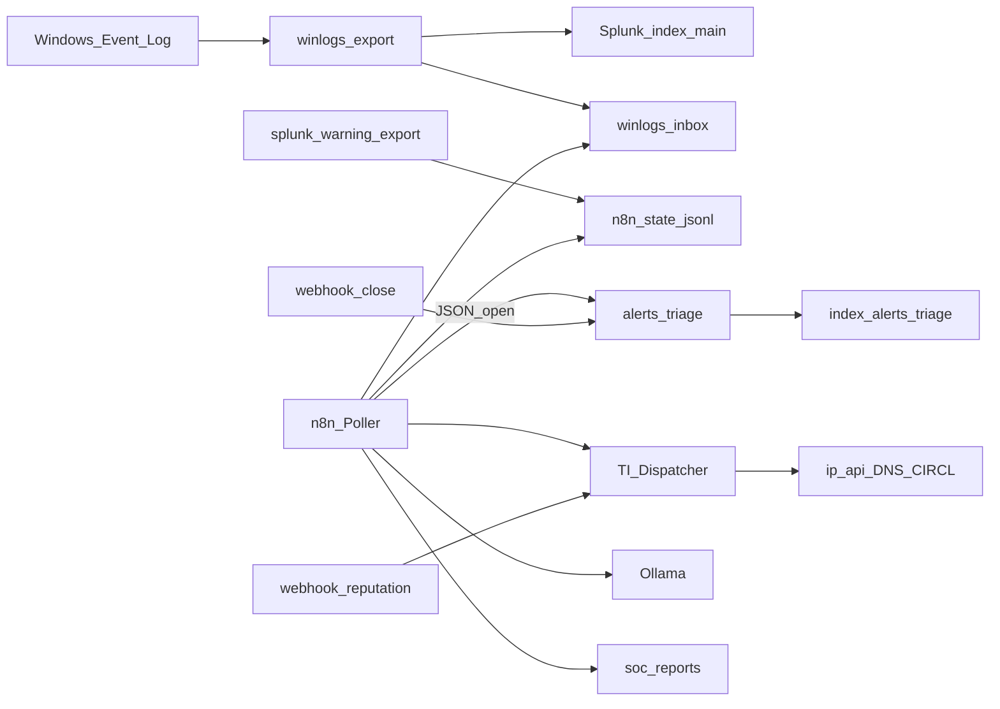

# SOC n8n + Splunk Lab

[](LICENSE)
[]()

Laboratorio di **automazione SOC** su infrastruttura domestica (NUC): ingest di log Windows in **Splunk Free**, orchestration con **n8n**, enrichment IOC e supporto al triage con **Ollama**.

Autore: **Federico Parisi** — SOC Analyst · [LinkedIn](https://www.linkedin.com/in/federico-parisi-0491a4212/) · [DarkGreen Projects](https://github.com/DarkGreen-projects)

---

## Contesto

Splunk Free non espone alert programmate native e disabilita il login REST remoto. In molti ambienti reali si separa comunque il SIEM dall’orchestration: questo lab applica lo stesso principio in modo esplicito e riproducibile.

| Limite Splunk Free | Approccio nel lab |
| --- | --- |
| Nessuna Schedule Alert UI | Workflow n8n con trigger temporale |
| Nessun Incident Review (ES) | Index dedicato `alerts_triage` (stati open/closed) |
| REST remoto non autenticabile | Bridge host `splunk-warning-export.ps1` e fallback su `winlogs-inbox` |
| Nessun budget TI commerciale | Fonti pubbliche (ip-api, DNS, CIRCL) e stub dichiarati per VT/Shodan/AbuseIPDB/MISP |

L’obiettivo non è simulare una licenza Enterprise: è mostrare decisioni di design coerenti con vincoli di prodotto.

---

## Architettura



Flusso sintetico: i log vengono esportati e indexati in Splunk; n8n rileva eventi Warning+, apre un caso di triage, arricchisce eventuali indicatori, produce un report HTML e (se disponibile) un riassunto via Ollama. La chiusura avviene tramite webhook e aggiorna lo stato in Splunk.

Documentazione di dettaglio: [docs/ARCHITETTURA.md](docs/ARCHITETTURA.md)

---

## Componenti

- **Ingest Windows Event Log** — export JSON verso Splunk (`index=main`)
- **Detection Warning+** — poller n8n su livelli Avviso / Errore / Critico
- **Triage** — eventi `open` / `closed` in `alerts_triage`
- **TI Dispatcher** — reputation IP, domain, hash, CVE con risposta HTML
- **Report** — artefatti in `soc-reports/`
- **Chiusura** — webhook `/webhook/lab-close`

---

## Workflow n8n

Export in [`workflows/`](workflows/). Il modello Dispatcher/reputation prende spunto da [inthecyber-group/securityonion-n8n-workflows](https://github.com/inthecyber-group/securityonion-n8n-workflows), adattato a Splunk Free e al triage di lab.

| Workflow | Ruolo |
| --- | --- |
| [LAB-TI-Dispatcher](workflows/LAB-TI-Dispatcher.json) | Webhook reputation → report HTML |
| [LAB-IP / Domain / Hash / CVE](workflows/) | Moduli di enrichment (fonti free + stub) |
| [LAB-Splunk-Warning-Poller](workflows/LAB-Splunk-Warning-Poller.json) | Schedule: detection → triage → enrich → Ollama → report |
| [LAB-Close-Alert](workflows/LAB-Close-Alert.json) | Chiusura alert via webhook |
| [LAB-Manual-Demo-Pipeline](workflows/LAB-Manual-Demo-Pipeline.json) | Esecuzione manuale senza attendere lo schedule |

Note operative: [docs/WORKFLOWS.md](docs/WORKFLOWS.md)

---

## Avvio rapido

Il repository contiene workflow e script; il runtime tipico è uno stack Docker sull’host (es. `C:\lab`).

```powershell
powershell -File .\scripts\import-n8n-workflows.ps1
powershell -File .\scripts\demo-soc-pipeline.ps1
powershell -File .\scripts\splunk-warning-export.ps1
```

Checklist e risultati attesi: [docs/DEMO.md](docs/DEMO.md)

| Endpoint | Funzione |
| --- | --- |
| http://localhost:5678/webhook/lab-reputation?ip=8.8.8.8 | Report IP |
| `POST /webhook/lab-close` con `{"alert_id":"...","owner":"demo"}` | Chiusura triage |
| http://localhost:8000 | Splunk UI (`index=alerts_triage`) |
| http://localhost:5678 | n8n |

**Stack:** Splunk Free · n8n · Docker Compose · PowerShell · Ollama · Windows Event Log

**Progetti correlati:** [soc-automation-hub](https://github.com/DarkGreen-projects/soc-automation-hub) · [Decoder_SIEMjoson](https://github.com/DarkGreen-projects/Decoder_SIEMjoson) · [darkgreen-siem](https://github.com/DarkGreen-projects/darkgreen-siem)

---

## Sicurezza

Nel repository non sono presenti secret (solo [`.env.example`](.env.example)). Non pubblicare log Windows reali né report con dati interni.

## Licenza e contatti

MIT — [LICENSE](LICENSE)  
GitHub: [@DarkGreen-projects](https://github.com/DarkGreen-projects) · LinkedIn: [federico-parisi-0491a4212](https://www.linkedin.com/in/federico-parisi-0491a4212/)
