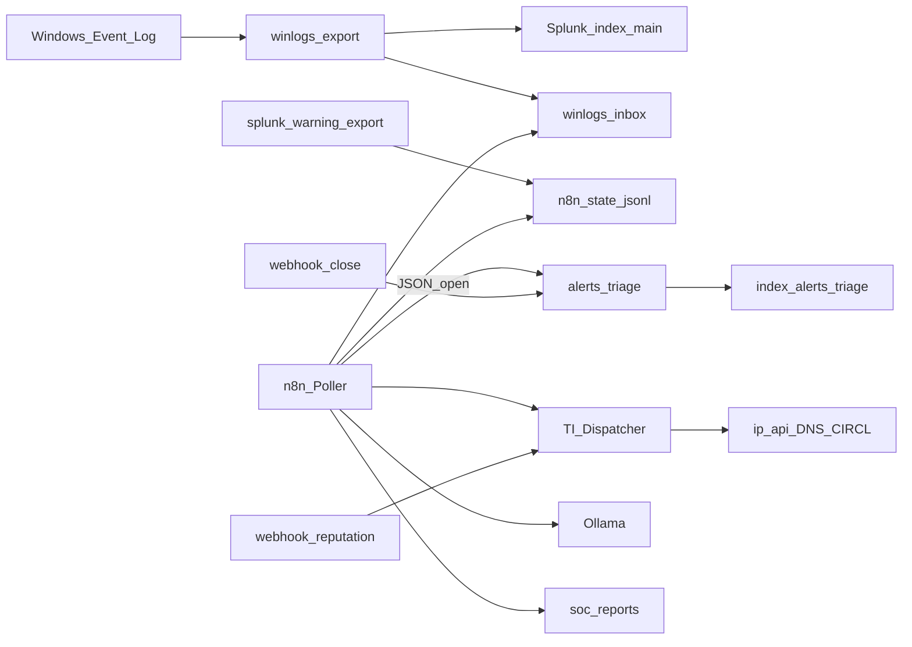

# SOC n8n + Splunk Lab

[](LICENSE)
[]()
[]()
[](https://github.com/DarkGreen-projects)

**Lab di automazione SOC end-to-end**: ingest log Windows → **Splunk Free** (SIEM) → **n8n** (orchestration / SOAR) → triage open/closed → enrichment IOC → report HTML → riassunto **Ollama** → chiusura alert.

Creato da **Federico Parisi** ([LinkedIn](https://www.linkedin.com/in/federico-parisi-0491a4212/)) — SOC Analyst con background da sviluppatore.

---

## Perché esiste questo progetto

Su **Splunk Free** non sono disponibili le alert programmate native, e il **login REST remoto è disabilitato**. In un contesto reale molti team risolvono separando **SIEM** e **SOAR**.

Questo lab rende esplicita quella scelta:

| Limite Splunk Free | Soluzione nel lab |
| --- | --- |
| Niente Schedule Alert UI | **n8n** schedule + workflow |
| Niente Incident Review / ES | Index `alerts_triage` (open/closed) |
| Niente REST auth remoto | Bridge host `splunk-warning-export.ps1` + fallback `winlogs-inbox` |
| Budget TI a pagamento | Fonti **free** (ip-api, DNS, CIRCL) + **stub** VT/Shodan/AbuseIPDB/MISP |

Il risultato è una demo **funzionante e raccontabile** in colloquio — non solo mock UI.

---

## Cosa fa (funzioni)

| Funzione | Componente | Descrizione |
| --- | --- | --- |
| Ingest Windows Event Log | `winlogs-export.ps1` → Splunk | System/Application/Security* in JSON su `index=main` |
| Detection Warning+ | Poller n8n | Legge eventi Avviso/Errore/Critico (bridge o inbox) |
| Triage open | JSON → `alerts_triage` | Contatori “non presi in carico” in Splunk |
| Enrichment IOC | TI Dispatcher | IP / domain / hash / CVE → report HTML |
| Threat intel free | ip-api, Google DNS, CIRCL | Geo, resolve, CVE senza API key a pagamento |
| Stub TI enterprise | VT / Shodan / AbuseIPDB / MISP | Messaggio esplicito `provider=stub` (slot upgrade) |
| AI triage | Ollama | Riassunto in italiano (3–5 bullet) se modello presente |
| Report caso | `soc-reports/*.html` | Artefatto dimostrabile per portfolio/colloquio |
| Chiusura alert | Webhook `/webhook/lab-close` | Scrive `status=closed` (allinea dashboard) |

---

## Architettura



Dettaglio: [docs/ARCHITETTURA.md](docs/ARCHITETTURA.md)

---

## Workflow n8n (export JSON)

| Workflow | Trigger | Ruolo |
| --- | --- | --- |
| [LAB - TI Dispatcher](workflows/LAB-TI-Dispatcher.json) | Webhook `lab-reputation` | Route `?ip=` / `?domain=` / `?hash=` / `?cve=` → HTML |
| [LAB - IP Reputation](workflows/LAB-IP-Reputation.json) | Sub-workflow | Geo ip-api + stub TI |
| [LAB - Domain Reputation](workflows/LAB-Domain-Reputation.json) | Sub-workflow | Google DNS + stub |
| [LAB - Hash Reputation](workflows/LAB-Hash-Reputation.json) | Sub-workflow | Validazione hash + stub VT |
| [LAB - CVE Info](workflows/LAB-CVE-Info.json) | Sub-workflow | CIRCL CVE (no key) |
| [LAB - Splunk Warning Poller](workflows/LAB-Splunk-Warning-Poller.json) | Schedule 5 min | Detection → triage → enrich → Ollama → report |
| [LAB - Close Alert](workflows/LAB-Close-Alert.json) | Webhook `lab-close` | Chiude alert |
| [LAB - Manual Demo Pipeline](workflows/LAB-Manual-Demo-Pipeline.json) | Manuale | Demo senza attendere lo schedule |

Guida: [docs/WORKFLOWS.md](docs/WORKFLOWS.md)

Pattern ispirato a [inthecyber-group/securityonion-n8n-workflows](https://github.com/inthecyber-group/securityonion-n8n-workflows), adattato a Splunk Free + triage + AI.

---

## Stack

`Splunk Free` · `n8n` · `Docker Compose` · `PowerShell` · `Ollama` · `Windows Event Log` · `Threat Intelligence` (free/stub)

Progetti correlati:

- [soc-automation-hub](https://github.com/DarkGreen-projects/soc-automation-hub) — demo web SOC (5 moduli) + desktop VT  
- [Decoder_SIEMjoson](https://github.com/DarkGreen-projects/Decoder_SIEMjoson) — parse SIEM multi-vendor + OSINT  
- [darkgreen-siem](https://github.com/DarkGreen-projects/darkgreen-siem) — SIEM demo multi-fonte  

---

## Quick start (runtime sul lab NUC)

Il codice di orchestrazione è in questo repo; il **runtime** tipico è un lab Docker su host Windows (es. `C:\lab`).

1. Copiare/adattare i workflow in `workflows/` e gli script in `scripts/`
2. Avviare stack Splunk + n8n + Ollama
3. Importare i workflow:

```powershell
powershell -File .\scripts\import-n8n-workflows.ps1
```

4. Test end-to-end:

```powershell
powershell -File .\scripts\demo-soc-pipeline.ps1
```

5. (Opzionale) bridge Splunk CLI → n8n:

```powershell
powershell -File .\scripts\splunk-warning-export.ps1
```

Checklist colloquio / screenshot: [docs/DEMO.md](docs/DEMO.md)

### Endpoint demo

| URL | Uso |
| --- | --- |
| `http://localhost:5678/webhook/lab-reputation?ip=8.8.8.8` | Report HTML IP |
| `POST /webhook/lab-close` body `{"alert_id":"...","owner":"demo"}` | Chiude alert |
| `http://localhost:8000` | Splunk UI (`index=alerts_triage`) |
| `http://localhost:5678` | n8n UI |

---

## Cosa mostrare in colloquio

1. Diagramma SIEM ↔ SOAR e **perché n8n** sul Free  
2. Report HTML reputation (geo reale + stub TI espliciti)  
3. File triage open/closed e search Splunk  
4. Esecuzione `demo-soc-pipeline.ps1`  
5. (Opzionale) bullet AI da Ollama nel report  

Messaggio chiave: *so lavorare con vincoli di licenza e progettare automazioni SOC realistici, non solo tutorial Enterprise.*

---

## Sicurezza e dati

- Nessun secret in repo (vedi [`.env.example`](.env.example))
- Esempi e stub: niente chiavi VirusTotal/Shodan/AbuseIPDB obbligatorie
- Non pubblicare log Windows reali né report con dati produttivi

---

## Attribution

Dispatcher / reputation: ispirato a InTheCyber Group — [Automated Threat Intelligence Analysis with n8n and Security Onion](https://github.com/inthecyber-group/securityonion-n8n-workflows).  
Adattamento lab Splunk Free + triage + Ollama: DarkGreen Projects.

---

## Licenza

MIT — vedi [LICENSE](LICENSE).

## Contatti

- GitHub: [@DarkGreen-projects](https://github.com/DarkGreen-projects)  
- LinkedIn: [federico-parisi-0491a4212](https://www.linkedin.com/in/federico-parisi-0491a4212/)
