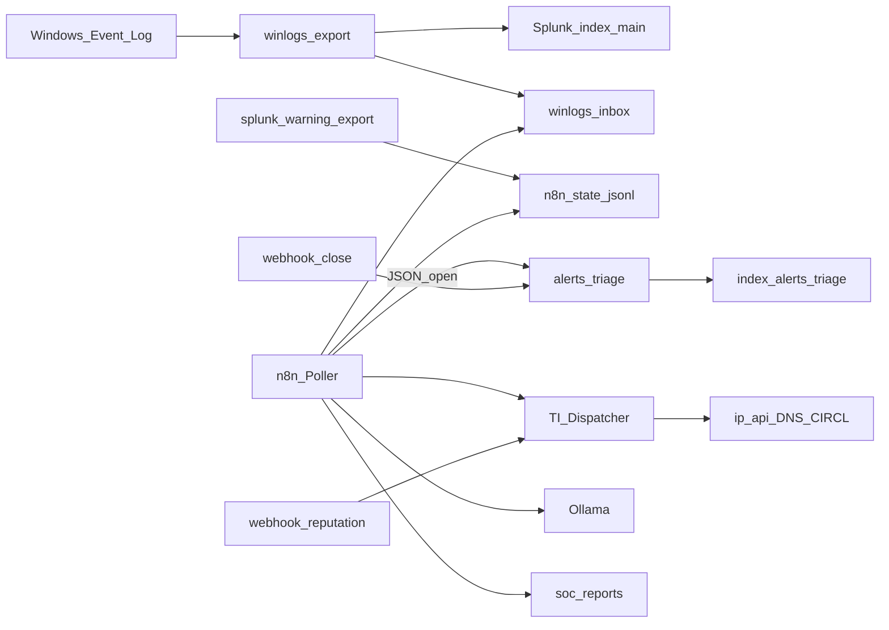

# SOC n8n + Splunk Lab

[](LICENSE)
---

## Perché

Uso Splunk Free. Lì le alert schedulate non ci sono, e se n8n prova a chiamare il REST prende un bel `401` (*remote login disabled*).  
Invece di fingere di avere Enterprise, ho fatto la cosa che faresti anche in azienda con vincoli simili: SIEM da una parte, orchestration dall’altra.

| Limite Free | Come l’ho aggirato |
| --- | --- |
| Niente Schedule Alert | Workflow n8n ogni 5 minuti |
| Niente Incident Review | Index `alerts_triage` con open/closed |
| REST remoto chiuso | Script host `splunk-warning-export.ps1` (+ fallback sui JSON in `winlogs-inbox`) |
| Niente budget VT/Shodan | ip-api / DNS / CIRCL live; VT/Shodan/AbuseIPDB/MISP come stub espliciti |

---

## Flusso



In pratica: i log finiscono in Splunk *e* in una cartella; n8n pesca i Warning+, apre un triage, arricchisce eventuali IOC, scrive un HTML, chiede un riassunto a Ollama se è su, e lascia chiudere l’alert con un webhook.

Altro dettaglio: [docs/ARCHITETTURA.md](docs/ARCHITETTURA.md)

---

## Pezzi principali

- **Export Windows** → JSON in inbox, Splunk li indexa su `main`
- **Poller n8n** → Warning+ (Avviso/Errore/Critico), dedup, triage `open`
- **Dispatcher** → `?ip=` / `?domain=` / `?hash=` / `?cve=` e risponde con un report HTML
- **Close** → POST con `alert_id`, scrive `closed` (i contatori in Splunk seguono)
- **Report** in `soc-reports/` — utile per vedere che qualcosa è davvero uscito dalla pipeline

---

## Workflow (JSON)

Sono in [`workflows/`](workflows/). L’idea del Dispatcher viene da [inthecyber Security Onion + n8n](https://github.com/inthecyber-group/securityonion-n8n-workflows); qui è adattato a Splunk Free e al triage.

| File | A cosa serve |
| --- | --- |
| [LAB-TI-Dispatcher](workflows/LAB-TI-Dispatcher.json) | Webhook reputation → HTML |
| [LAB-IP / Domain / Hash / CVE](workflows/) | Moduli enrichment (free + stub) |
| [LAB-Splunk-Warning-Poller](workflows/LAB-Splunk-Warning-Poller.json) | Schedule: detect → triage → enrich → Ollama → report |
| [LAB-Close-Alert](workflows/LAB-Close-Alert.json) | Webhook di chiusura |
| [LAB-Manual-Demo-Pipeline](workflows/LAB-Manual-Demo-Pipeline.json) | Prova a mano senza aspettare i 5 minuti |

Note operative: [docs/WORKFLOWS.md](docs/WORKFLOWS.md)

---

## Avvio (sul lab, tipicamente `C:\lab`)

Questo repo porta workflow e script; lo stack Docker vive sull’host.

```powershell
powershell -File .\scripts\import-n8n-workflows.ps1
powershell -File .\scripts\demo-soc-pipeline.ps1
# se vuoi alimentare il poller da una search Splunk via docker exec:
powershell -File .\scripts\splunk-warning-export.ps1
```

Checklist e cosa aspettarsi: [docs/DEMO.md](docs/DEMO.md)

| Dove | Cosa |
| --- | --- |
| http://localhost:5678/webhook/lab-reputation?ip=8.8.8.8 | Report IP |
| `POST /webhook/lab-close` `{"alert_id":"...","owner":"demo"}` | Chiude |
| http://localhost:8000 | Splunk (`index=alerts_triage`) |
| http://localhost:5678 | n8n |

Stack: Splunk Free, n8n, Docker, PowerShell, Ollama.

Altri pezzi del portfolio: [soc-automation-hub](https://github.com/DarkGreen-projects/soc-automation-hub), [Decoder_SIEMjoson](https://github.com/DarkGreen-projects/Decoder_SIEMjoson), [darkgreen-siem](https://github.com/DarkGreen-projects/darkgreen-siem).

---

## Dati

Niente secret nel repo (c’è solo [`.env.example`](.env.example)). Non committare log Windows veri né report con dati personali.

MIT — [LICENSE](LICENSE).  
Contatti: [@DarkGreen-projects](https://github.com/DarkGreen-projects) · [LinkedIn](https://www.linkedin.com/in/federico-parisi-0491a4212/)
