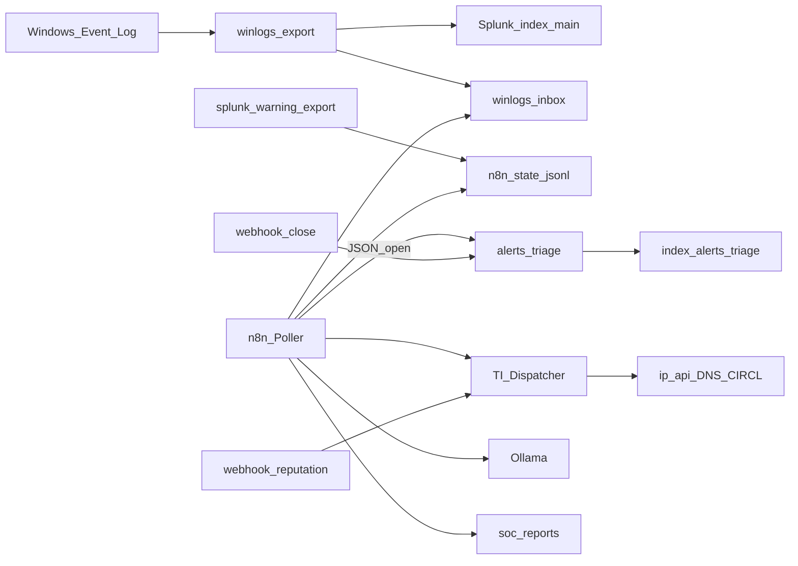

# Architettura

Il laboratorio gira su host Windows (NUC) con Docker Compose. Splunk svolge il ruolo di SIEM; n8n quello di orchestration a fronte dei limiti della licenza Free.

I Windows Event Log vengono esportati in JSON. Splunk li acquisisce da `winlogs-inbox` e li indexa in `index=main`. La stessa sorgente file (oppure un bridge generato da `splunk search` via `docker exec`) alimenta il poller n8n: in questo modo non si dipende dal REST Splunk, non utilizzabile in autenticazione remota sulla Free.

Alla rilevazione di eventi Warning+, n8n scrive un record `open` in `alerts-triage-inbox` (index Splunk `alerts_triage`), estrae eventuali IOC dal messaggio, invoca il Dispatcher per il report HTML e, se Ollama è disponibile, richiede un riassunto in italiano. La chiusura produce un nuovo evento `closed` via webhook; in Splunk lo stato corrente si ottiene con `latest(status)` per `alert_id`.

## Diagramma

## Vincoli Splunk Free

| Vincolo | Impatto | Mitigazione |
| --- | --- | --- |
| Nessuna alert schedulata nativa | Non si usa Save As → Alert | Schedule Trigger in n8n |
| Nessun Enterprise Security | Assenza di Incident Review | Index di triage custom |
| Remote login disabilitato | REST da n8n → 401 | `splunk-warning-export.ps1` e fallback su file |
| Limite 500 MB/giorno | Quota da monitorare | Ingest tipico di lab nell’ordine di pochi MB/giorno |

Questi vincoli sono documentati di proposito: motivano le scelte di architettura.

## Path runtime (esempio `C:\lab`)

| Path | Contenuto |
| --- | --- |
| `data/winlogs-inbox` | JSON di export (Splunk + fallback n8n) |
| `data/alerts-triage-inbox` | Eventi triage open/closed |
| `data/soc-reports` | Report HTML |
| `data/n8n-state` | Dedup e bridge `warning-plus.jsonl` |
| `exports/n8n-workflows` | Mirror locale dei workflow di questo repository |

## Enrichment

Fonti operative senza API key a pagamento: ip-api.com (geo), Google DNS JSON, cve.circl.lu.  
VirusTotal, Shodan, AbuseIPDB e MISP sono presenti come stub dichiarati, pronti per un’integrazione successiva con credenziali reali.

## Porte

| Servizio | Porta |
| --- | --- |
| Splunk UI | 8000 |
| Splunk management | 8089 (non utilizzabile in auth remota su Free) |
| n8n | 5678 |
| Ollama | 11434 |
