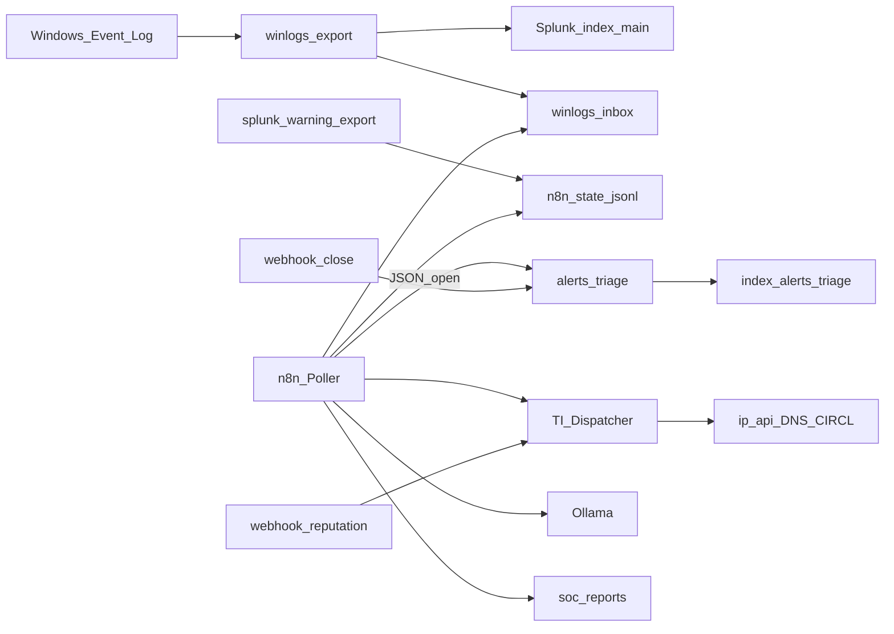

# Architettura

## Panoramica

Pipeline lab SOC su host Windows (NUC) con Docker Compose:

1. **Ingest** — Event Log → JSON lines → Splunk `index=main`
2. **Detection** — n8n poller su Warning+ (bridge o `winlogs-inbox`)
3. **Triage** — eventi JSON `status=open|closed` → Splunk `index=alerts_triage`
4. **Enrichment** — webhook Dispatcher IOC → HTML report
5. **AI** — Ollama genera un breve triage in italiano
6. **Chiusura** — webhook close allinea i contatori dashboard

## Diagramma

## Vincoli Splunk Free (decisione di design)

| Vincolo | Impatto | Mitigazione lab |
| --- | --- | --- |
| No scheduled alerts native | Non si usa Save As → Alert | n8n Schedule Trigger |
| No Enterprise Security | Niente Incident Review | Index triage custom |
| Remote login REST disabilitato | `401` su `/services/...` da n8n | `splunk-warning-export.ps1` via `docker exec` + fallback file |
| 500 MB/giorno indexed | Quota da monitorare | Ingest tipico lab ~2–5 MB/giorno |

Questa sezione è intenzionale nel portfolio: mostra consapevolezza dei limiti di prodotto e capacità di progettare workaround operativi.

## Componenti runtime (esempio `C:\lab`)

| Path | Ruolo |
| --- | --- |
| `data/winlogs-inbox` | JSON esportati (monitor Splunk + fallback n8n) |
| `data/alerts-triage-inbox` | Eventi triage open/closed |
| `data/soc-reports` | Report HTML generati |
| `data/n8n-state` | Dedup `seen-alerts.json` + `warning-plus.jsonl` |
| `exports/n8n-workflows` | JSON workflow (mirror di `workflows/` in questo repo) |

## Enrichment: free vs stub

| Fonte | Modalità |
| --- | --- |
| ip-api.com | Live geo/ISP |
| dns.google | Live resolve A |
| cve.circl.lu | Live CVE |
| VirusTotal / Shodan / AbuseIPDB / MISP | Stub esplicito — pronti per API key future |

## Porte tipiche

| Servizio | Porta |
| --- | --- |
| Splunk UI | 8000 |
| Splunk management | 8089 (debug; Free senza remote auth) |
| n8n | 5678 |
| Ollama | 11434 |
