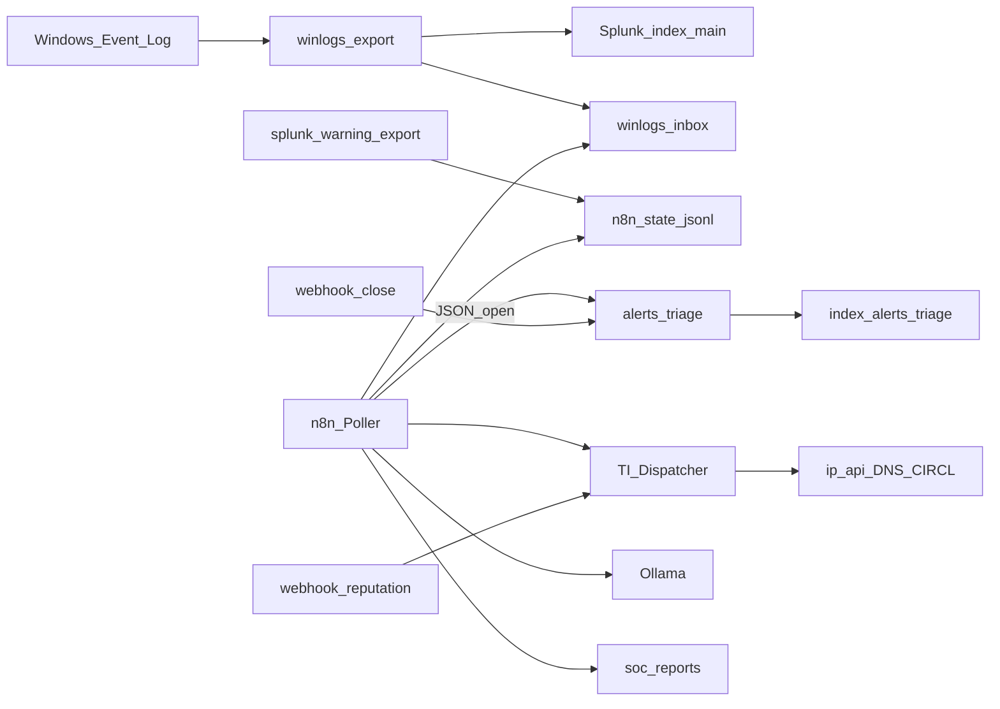

# Architettura

Il lab gira sul NUC Windows con Docker Compose. Splunk tiene i log; n8n fa da “SOAR povero ma onesto”.

I log Event Viewer vengono esportati in JSON. Splunk li legge da `winlogs-inbox` e li mette in `index=main`. La stessa cartella (o un file bridge prodotto da una search via `docker exec`) alimenta il poller n8n: così non dipendo dal REST Splunk, che sul Free rifiuta il login remoto.

Quando spunta un Warning+, n8n scrive un JSON `open` in `alerts-triage-inbox` (Splunk lo indexa come `alerts_triage`), prova a estrarre IOC dal messaggio, chiama il Dispatcher per il report HTML, e se Ollama è su chiede un riassunto corto in italiano. La chiusura è un altro evento JSON (`closed`) via webhook: in Splunk conti con `latest(status)` per `alert_id`.

## Diagramma

## Limiti Free (e perché restano scritti qui)

| Vincolo | Cosa succede | Nel lab |
| --- | --- | --- |
| No alert schedulate | Save As → Alert non è un’opzione seria | Schedule n8n |
| No ES / Incident Review | Niente coda incidenti nativa | Index triage custom |
| Remote login off | REST da n8n → 401 | `splunk-warning-export.ps1` + fallback file |
| 500 MB/giorno | Quota da tenere d’occhio | Su questo NUC di solito pochi MB/giorno |

Non è marketing: è il motivo per cui il disegno è fatto così.

## Cartelle tipiche (`C:\lab`)

| Path | Cosa ci trovi |
| --- | --- |
| `data/winlogs-inbox` | JSON export (Splunk + fallback n8n) |
| `data/alerts-triage-inbox` | open/closed del triage |
| `data/soc-reports` | HTML generati |
| `data/n8n-state` | `seen-alerts.json`, `warning-plus.jsonl` |
| `exports/n8n-workflows` | copia locale dei JSON di questo repo |

## Enrichment

Live senza key: ip-api (geo), Google DNS, CIRCL CVE.  
Stub voluti: VirusTotal, Shodan, AbuseIPDB, MISP — nel report c’è scritto chiaro che sono stub, così non sembri di avere API che non hai.

## Porte

Splunk UI `8000`, management `8089` (poco utile in auth da remoto sul Free), n8n `5678`, Ollama `11434`.
